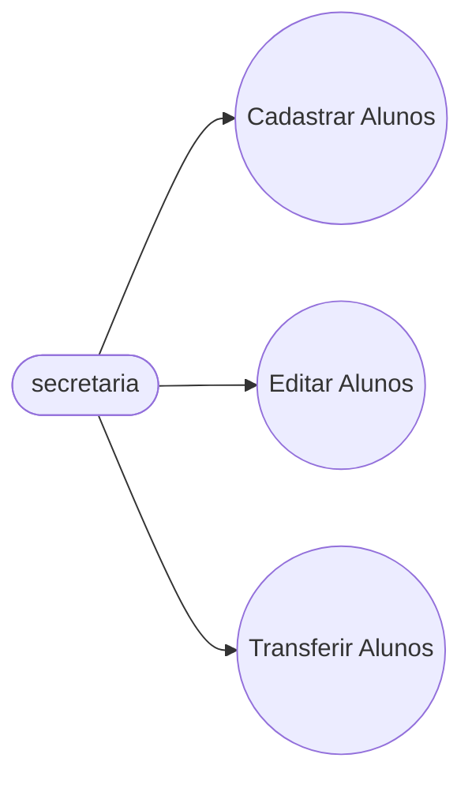
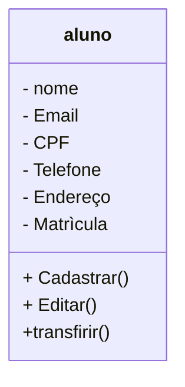

# projeto universidade

modelagem em Orientação à Objetos das Entidades Alunos, Curso e turmas.

## caso de uso

## Diagrama de Classe 

## Dependências**:
- **VSCode**: IDE(interface de desnvolvimento)

- **Mermaind**: Linguagem para confecção de Diagramas em documentos MD (Mark Dow)

- **Material Icon Theme**: Tema para colorir as pastas.

- **Gitlens Lens**: Interface grafica para o vercionamento .git integrada no VScode.